## Scope & Rules of Engagement

-Zakres testow penetracyjnych obejmuje siec lokalna 10.10.10.0/24

-Testy prowadzone sa poza godzinami pracy w firmie

-Testy sa prowadzone na poziomie grey-box - jest dostep do sieci LAN, znajomosc zakresu
sieci, szacowana ilosc urzadzen oraz spodziewane oprogramowanie

## Reconnaissance & Discovery

W ramach rozpoznania wstepnego sieci zostal wykonany skan wykrywajacy
hosty w sieci.

```
sudo netdiscover -r 10.10.10.0/24

4 Captured ARP Req/Rep packets, from 4 hosts. Total size: 240
_____________________________________________________________________________
  IP             At MAC Address               Count        Len MAC Vendor / Hostname
-----------------------------------------------------------------------------
10.10.10.2             08:00:27:ee:2b:7a                 1       60 PCS Systemtechnik GmbH
10.10.10.3             08:00:27:dd:0f:3f                1       60 PCS Systemtechnik GmbH
10.10.10.7             08:00:27:66:dc:64                  1       60 PCS Systemtechnik GmbH
10.10.10.8             08:00:27:c2:d5:e3                 1       60 PCS Systemtechnik
GmbH
```

```
sudo nmap -sn 10.10.10.0/24
Nmap scan report for 10.10.10.2
Host is up (0.0022s latency).
MAC Address: 08:00:27:EE:2B:7A (Oracle VirtualBox virtual NIC)
Nmap scan report for 10.10.10.3
Host is up (0.00065s latency).
MAC Address: 08:00:27:DD:0F:3F (Oracle VirtualBox virtual NIC)
Nmap scan report for 10.10.10.7
Host is up (0.0011s latency).
MAC Address: 08:00:27:66:DC:64 (Oracle VirtualBox virtual NIC)
Nmap scan report for 10.10.10.8
Host is up (0.0012s latency).
MAC Address: 08:00:27:C2:D5:E3 (Oracle VirtualBox virtual NIC)
```

```
sudo nbtscan -r 10.10.10.0/24
Doing NBT name scan for addresses from 10.10.10.0/24

IP address         NetBIOS Name                Server User                      MAC address
     ------------------------------------------------------------------------------
10.10.10.3           FS01                 <server> <unknown>                        08:00:27:dd:0f:3f
10.10.10.8           WIN8                 <server> <unknown>                        08:00:27:c2:d5:e3
10.10.10.2           DC01                 <server> <unknown>                        08:00:27:ee:2b:7a
10.10.10.7           WIN7                 <server> <unknown>                        08:00:27:66:dc:64
```

```
    IP address   Name          MAC address
1   10.10.10.2   DC01          08:00:27:ee:2b:7a
2   10.10.10.3   FS01          08:00:27:dd:0f:3f
3   10.10.10.7   WIN7          08:00:27:66:dc:64
4   10.10.10.8   WIN8          08:00:27:c2:d5:e3
```

## Scanning & Service identification

Przejscie do szerszego skanu, wykrywajacego dzialajace serwis na hostach
oraz ich rodzaje (na potrzeby zwiekszenia przejrzystosci wynikow output
niektorych skanow zostal zmniejszony, nie zmieniajac przy tym znaczenia
rezultatow).

```
nmap -sS -Pn -T3 --top-ports 200 -iL targets.txt

Nmap scan report for 10.10.10.2
PORT    STATE SERVICE
53/tcp open domain
88/tcp open kerberos-sec
135/tcp open msrpc
139/tcp open netbios-ssn
389/tcp open ldap
445/tcp open microsoft-ds
464/tcp open kpasswd5
593/tcp open http-rpc-epmap
636/tcp open ldapssl
3268/tcp open globalcatLDAP
49154/tcp open unknown
49156/tcp open unknown
49157/tcp open unknown

Nmap scan report for 10.10.10.3
PORT    STATE SERVICE
135/tcp open msrpc
139/tcp open netbios-ssn
445/tcp open microsoft-ds
49154/tcp open unknown

Nmap scan report for 10.10.10.7
PORT    STATE SERVICE
135/tcp open msrpc
139/tcp open netbios-ssn
445/tcp open microsoft-ds
3389/tcp open ms-wbt-server
49152/tcp open unknown
49153/tcp open unknown
49154/tcp open unknown
49155/tcp open unknown
49156/tcp open unknown

Nmap scan report for 10.10.10.8
PORT   STATE SERVICE
135/tcp open msrpc
139/tcp open netbios-ssn
445/tcp open microsoft-ds
2869/tcp open icslap
3389/tcp open ms-wbt-server
```

## Scanning & Service identification

```
nmap -sS -sV -Pn -T3 --top-ports 200 -O --version-intensity 9 -iL
targets.txt

Nmap scan report for 10.10.10.2
PORT     STATE SERVICE       VERSION
53/tcp open domain           Microsoft DNS 6.0.6002 (17724655) (Windows Server 2008
SP2)
88/tcp open kerberos-sec Microsoft Windows Kerberos (server time: 2026-01-30
17:10:01Z)
135/tcp open msrpc           Microsoft Windows RPC
139/tcp open netbios-ssn Microsoft Windows netbios-ssn
389/tcp open ldap           Microsoft Windows Active Directory LDAP (Domain: corpo.local,
Site: Default-First-Site-Name)
445/tcp open microsoft-ds Microsoft Windows 2003 or 2008 microsoft-ds
464/tcp open kpasswd5?
593/tcp open ncacn_http Microsoft Windows RPC over HTTP 1.0
636/tcp open tcpwrapped
3268/tcp open ldap          Microsoft Windows Active Directory LDAP (Domain: corpo.local,
Site: Default-First-Site-Name)
49154/tcp open msrpc           Microsoft Windows RPC
49156/tcp open msrpc           Microsoft Windows RPC
49157/tcp open ncacn_http Microsoft Windows RPC over HTTP 1.0

Nmap scan report for 10.10.10.3
PORT    STATE SERVICE     VERSION
135/tcp open msrpc        Microsoft Windows RPC
139/tcp open netbios-ssn Microsoft Windows netbios-ssn
445/tcp open microsoft-ds Microsoft Windows Server 2008 R2 - 2012 microsoft-ds
49154/tcp open msrpc       Microsoft Windows RPC

Nmap scan report for 10.10.10.7
PORT     STATE SERVICE       VERSION
135/tcp open msrpc           Microsoft Windows RPC
139/tcp open netbios-ssn Microsoft Windows netbios-ssn
445/tcp open microsoft-ds Microsoft Windows 7 - 10 microsoft-ds (workgroup: CORPO)
3389/tcp open ms-wbt-server?
49152/tcp open msrpc          Microsoft Windows RPC
49153/tcp open msrpc          Microsoft Windows RPC
49154/tcp open msrpc          Microsoft Windows RPC
49155/tcp open msrpc          Microsoft Windows RPC
49156/tcp open msrpc          Microsoft Windows RPC
OS details: Microsoft Windows Vista SP2 or Windows 7 or Windows Server 2008 R2 or
Windows 8.1
Service Info: Host: WIN7; OS: Windows; CPE: cpe:/o:microsoft:windows

Nmap scan report for 10.10.10.8
PORT     STATE SERVICE      VERSION
135/tcp open msrpc          Microsoft Windows RPC
139/tcp open netbios-ssn Microsoft Windows netbios-ssn
445/tcp open microsoft-ds Microsoft Windows 7 - 10 microsoft-ds (workgroup: CORPO)
2869/tcp open http         Microsoft HTTPAPI httpd 2.0 (SSDP/UPnP)
3389/tcp open ms-wbt-server Microsoft Terminal Services
Service Info: Host: WIN8; OS: Windows; CPE: cpe:/o:microsoft:windows
```

## RDP identification & enumeration

```
nmap -Pn -p 3389 --script "rdp*" 10.10.10.7

Nmap scan report for 10.10.10.7
PORT    STATE SERVICE
3389/tcp open ms-wbt-server
|_rdp-enum-encryption: Received unhandled packet
MAC Address: 08:00:27:66:DC:64 (Oracle VirtualBox virtual NIC)
```

## RDP identification & enumeration

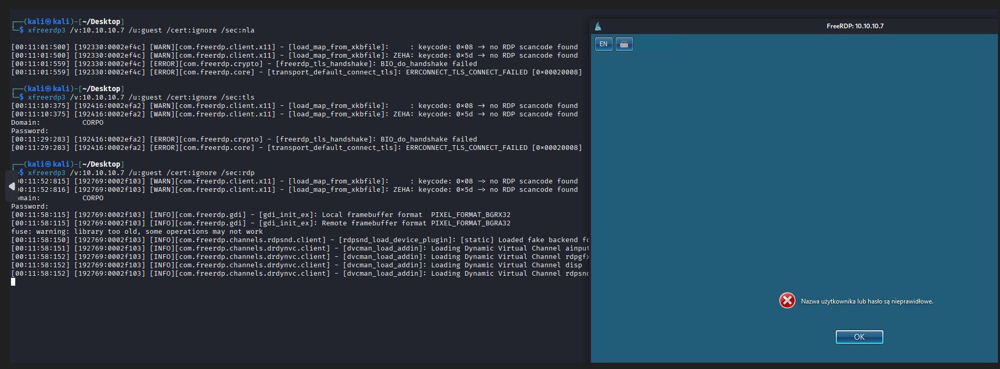

## RDP Exploitation & PoC

Proces exploitacji podatnosci uslugi RDP na hoscie win7
10.10.10.7

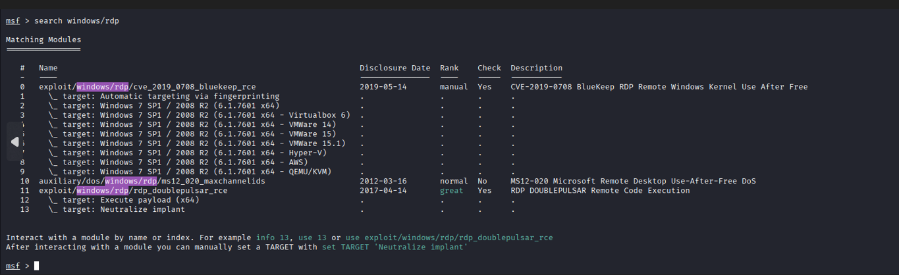

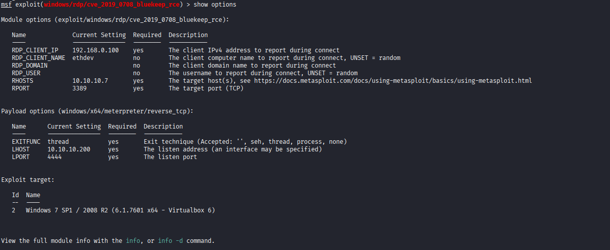

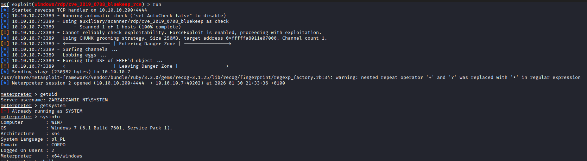

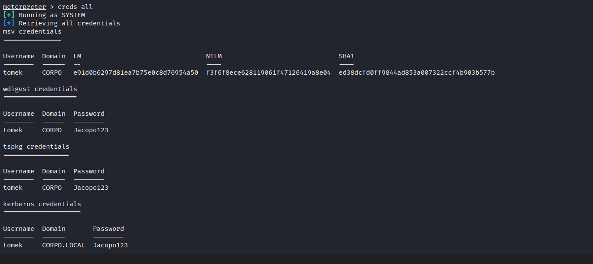

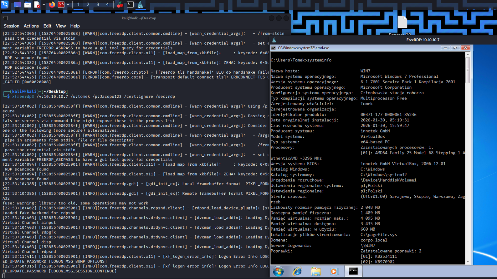

## SMB identification & enumeration

```
nmap -Pn -p 445 --script smb-protocols 10.10.10.2 10.10.10.3

Nmap scan report for 10.10.10.2
PORT STATE SERVICE
445/tcp open microsoft-ds
MAC Address: 08:00:27:EE:2B:7A (Oracle VirtualBox virtual NIC)

Host script results:
| smb-protocols:
| dialects:
|   NT LM 0.12 (SMBv1) [dangerous, but default]
|_ 2.0.2

Nmap scan report for 10.10.10.3
PORT STATE SERVICE
445/tcp open microsoft-ds
MAC Address: 08:00:27:DD:0F:3F (Oracle VirtualBox virtual NIC)

Host script results:
| smb-protocols:
| dialects:
|   NT LM 0.12 (SMBv1) [dangerous, but default]
|   2.0.2
|   2.1
|_ 3.0
```

## SMB identification & enumeration

```
nmap -Pn -p 445 --script smb-security-mode,smb2-security-
mode -oN 11.txt 10.10.10.2 10.10.10.3

Nmap scan report for 10.10.10.2
PORT STATE SERVICE
445/tcp open microsoft-ds
MAC Address: 08:00:27:EE:2B:7A (Oracle VirtualBox virtual NIC)

Host script results:
| smb-security-mode:
| account_used: guest
| authentication_level: user
| challenge_response: supported
|_ message_signing: required
| smb2-security-mode:
| 2.0.2:
|_ Message signing enabled and required

Nmap scan report for 10.10.10.3
PORT STATE SERVICE
445/tcp open microsoft-ds
MAC Address: 08:00:27:DD:0F:3F (Oracle VirtualBox virtual NIC)

Host script results:
| smb2-security-mode:
| 3.0:
|_ Message signing enabled but not required
| smb-security-mode:
| account_used: guest
| authentication_level: user
| challenge_response: supported
|_ message_signing: disabled (dangerous, but default)
```

## SMB exploitation & PoC

Proces exploitacji podatnosci SMB2 na hoscie win srv 2008
10.10.10.2

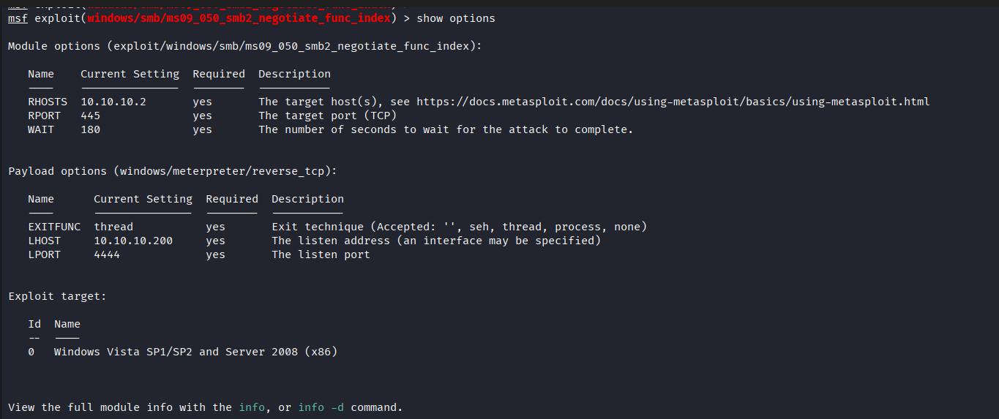

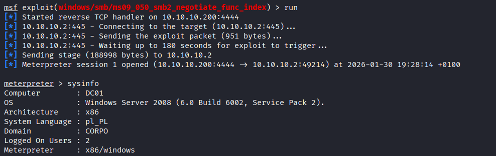

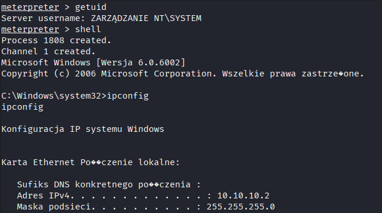

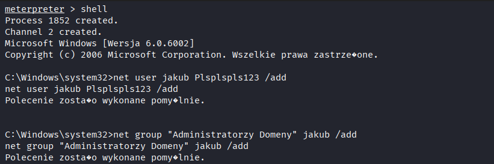

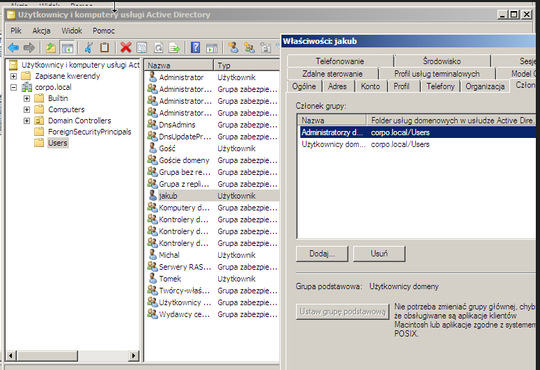

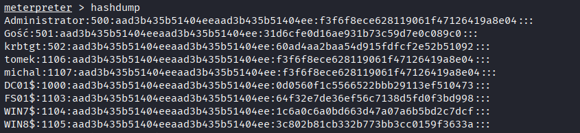

## Vulnerability Scanning

Ilosciowe podsumowanie podatnosci wykrytych w skanerze
podatnosci OPENVAS

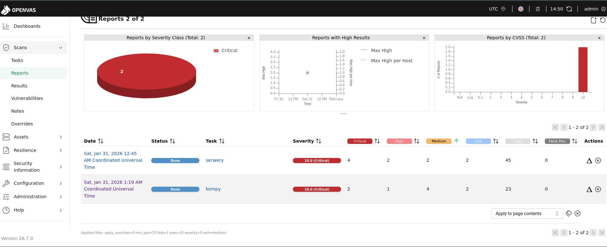

## Reporting and Remediation

Podczas testow penetracyjnych dokonano kompromitacji hostow za pomoca RCE na RDP i
SMB2 - uzyskano uprawnienia systemowe na systemie windows 7, ale wieksze znaczenie ma
to na domain controllerze-serwerze windows 2008.
Sa to luki w zabezpieczeniach, ktore niezwlocznie powinny zostac poddane mitygacji.

Ponizej wskazania priorytetowe:

-OS End of Life
Remediation: zalecany natychmiastowy upgrade albo wymiana sprzetu do nowszych wersji
systemowych

-BlueKeep: CVE-2019-0708 — CVSS v3.1: 9.8 (Critical) (CVSS:3.1/AV:N/AC:L/PR:N/UI:N/S:U/
C:H/I:H/A:H)
REMEDIATION: wymuszenie NLA, ograniczenie laczenia sie z RDP

-MS09-050 (SMBv2 Negotiation): CVE-2009-3103 — CVSS v2: 10.0 (High) (AV:N/AC:L/Au:N/
C:C/I:C/A:C).
REMEDIATION: patch na srv2.sys, hardening smb

Inne luki wykryte podczas skanowania automatycznego:

Microsoft HTTP.sys RCE Vulnerability (MS15-034) – CVE-2015-1635
Microsoft Windows SMB Server Multiple Vulnerabilities – Remote (4013389)
Microsoft Windows SMB/NETBIOS NULL Session Authentication Bypass Vulnerability
SSL/TLS: Report Weak Cipher Suites
SSL/TLS: Deprecated TLSv1.0 and TLSv1.1 Protocol Detection
SSL/TLS: Certificate Signed Using a Weak Signature Algorithm
DCE/RPC and MSRPC Services Enumeration Reporting
TCP Timestamps Information Disclosure
ICMP Timestamp Reply Information Disclosure
